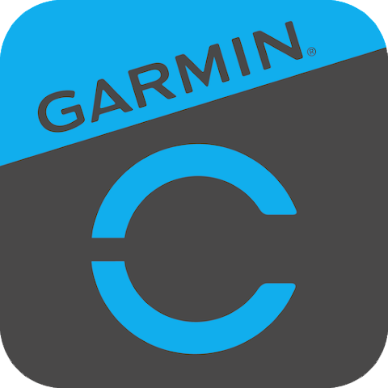

# GARMIN COMPLIANCE CHECKLIST - FRONTENDNEWBUILD

**Status:** 🟡 IN DEVELOPMENT (Not deployed to production)
**Parent Compliance Doc:** `/GARMIN-PRESERVATION-CHECKLIST.md`
**Last Updated:** 2025-11-14

---

## ✅ COMPLIANCE ITEMS IMPLEMENTED

### 1. Footer Attribution (REQUIRED)
**Location:** All HTML pages in `/frontendnewbuild/`

**Implementation:**
```html
<footer style="background: transparent; border-radius: 12px; padding: 25px; margin-top: 20px; text-align: center;">
    <div style="font-size: 12px; color: #666; margin-bottom: 15px;">Powered by Garmin, Strava, Whoop, and Oura</div>
    <div style="display: flex; justify-content: center; align-items: center; gap: 25px; flex-wrap: wrap;">
        
        <span style="color: #ddd;">|</span>
        
        <span style="color: #ddd;">|</span>
        
        <span style="color: #ddd;">|</span>
        
    </div>
</footer>
```

**Pages with Footer:**
- ✅ athlete-dashboard.html
- ✅ athlete-onboarding.html
- ✅ coach-dashboard.html
- ✅ invite-accept.html
- ✅ login.html

**Compliance Requirements Met:**
- ✅ "Powered by Garmin" text present
- ✅ Garmin Connect logo at 40px height (minimum requirement)
- ✅ Logo from official Garmin assets (GarminConnect.png)
- ✅ Native brand colors displayed (transparent background)
- ✅ Visual hierarchy (Garmin largest at 40px)
- ✅ Proper spacing and alignment

### 2. Logo Assets (REQUIRED)
**Location:** `/frontendnewbuild/src/images/`

**Copied from Production:**
- ✅ GarminConnect.png (70KB) - Official Garmin Connect logo at 40px
- ✅ strava.svg (1.1KB) - Strava logo at 20px
- ✅ WHOOP.svg (5.3KB) - WHOOP logo at 20px with white filter
- ✅ oura-logo.jpeg (6.0KB) - Oura logo at 35px

**Logo Specifications:**
| Provider | File | Height | Special Styling |
|----------|------|--------|----------------|
| Garmin | GarminConnect.png | 40px | Border-radius: 8px, box-shadow |
| Strava | strava.svg | 20px | None |
| WHOOP | WHOOP.svg | 20px | filter: invert(1) brightness(2) |
| Oura | oura-logo.jpeg | 35px | Border-radius: 8px, box-shadow |

### 3. Brand Guidelines Compliance

**Text Requirements:**
- ✅ Uses "Powered by Garmin, Strava, Whoop, and Oura"
- ✅ Garmin listed FIRST (per brand guidelines)
- ✅ Font size: 12px, color: #666
- ✅ Consistent across all pages

**Visual Requirements:**
- ✅ Transparent background (shows native brand colors)
- ✅ Garmin logo LARGER than others (40px vs 20-35px)
- ✅ Professional spacing (gap: 25px)
- ✅ Centered alignment
- ✅ Responsive flex-wrap for mobile

---

## 🔒 BACKEND DEPENDENCIES (DO NOT CHANGE)

These backend files are SHARED with production and must remain unchanged:

### OAuth Implementation
**Files:**
- `/backend/routes/legacy-routes.js` - Garmin OAuth flow
- `/frontend/garmin-oauth2.js` - OAuth client (reused in new build)

**Critical Settings:**
- Consumer Key: `ee6809d5-abc0-4a33-b38a-d433e5045987`
- Scope: `WELLNESS_READ` (changed from HEALTH_READ)
- PKCE flow enabled
- Redirect URI: registered with Garmin

### Required Endpoints
**Files:**
- `/backend/routes/garmin-health.js` - Webhook endpoints

**Endpoints (CANNOT MODIFY):**
1. `GET /api/garmin/ping` - Health check
2. `POST /api/garmin/push` - Data webhook
3. `POST /api/garmin/deregister` - User disconnect
4. `GET /api/garmin/permissions` - Data retention declaration

**Response Requirements:**
- Must respond within 30 seconds
- Must handle 100MB payloads
- Must return HTTP 200 on success

### Data Models
**Files:**
- `/backend/models/User.js`
- `/backend/models/Activity.js`
- `/backend/models/DailySummary.js`

**Critical Fields:**
- `provider: 'garmin'` enum value
- `garminAccessToken` encrypted field
- `garminUserId` unique identifier
- Field mappings from Garmin API

---

## ⚠️ COMPLIANCE GAPS (Inherited from Production)

These gaps exist in production and will be inherited by frontendnewbuild:

### 1. Data Retention Policy
**Issue:** Permissions endpoint declares 90-day retention, but data stored indefinitely
**Location:** `/backend/routes/garmin-health.js` line 130
**Risk:** Medium - Discrepancy between declared and actual policy
**Fix Required:** Implement scheduled cleanup job for data older than 90 days

### 2. Incomplete Deregistration
**Issue:** `/api/garmin/deregister` only deletes OAuth tokens, not activities/metrics
**Location:** `/backend/routes/garmin-health.js` lines 78-100
**Risk:** High - User data persists after disconnect
**Fix Required:** Delete ALL user data (activities, dailySummaries, metrics)

### 3. Missing Rate Limiting
**Issue:** No rate limits on Garmin API endpoints
**Risk:** Medium - Could abuse Garmin API quota
**Fix Required:** Add rate limiting middleware

---

## 🎯 DEPLOYMENT CHECKLIST

Before deploying frontendnewbuild to production:

### Pre-Deployment
- [ ] Verify Garmin approval is **CONFIRMED**
- [ ] Test footer renders correctly on all pages
- [ ] Verify logo files load (no 404s)
- [ ] Check mobile responsiveness of footer
- [ ] Ensure OAuth flow works with new pages
- [ ] Test invitation flow end-to-end
- [ ] Verify athlete onboarding connects to Garmin

### During Deployment
- [ ] Copy logo files to production `/frontend/src/images/`
- [ ] Add routes to `/server.js` for new pages
- [ ] Test Garmin OAuth flow immediately
- [ ] Verify `/api/garmin/ping` still responds
- [ ] Check footer on production URLs

### Post-Deployment
- [ ] Monitor Garmin webhook logs
- [ ] Verify data still syncing
- [ ] Check for any compliance warnings
- [ ] Test complete athlete signup flow
- [ ] Verify coach can invite athletes

---

## 📋 RECENT GARMIN CHANGES (Production)

### November 2025 Updates
Based on 159 commits since Nov 1, 2025:

**Logo Changes:**
- Nov 13: Fixed WHOOP logo size and color (filter: invert(1) brightness(2))
- Nov 13: Switched to WHOOP.svg from whoop-logo.jpeg
- Nov 13: Switched to strava.svg from strava-logo.jpeg
- Nov 13: Added logos to About page "Supported Platforms" section
- Nov 12: Adjusted Garmin logo to 40px (from 35px)

**Footer Changes:**
- Nov 13: Made attribution text fully white (#fff → #666 for better contrast)
- Nov 13: Changed wording from "Data powered by:" to "Powered by Garmin, Strava, Whoop, and Oura"
- Nov 12: Added footer to all dashboard pages
- Nov 12: Moved from external logo URLs to local files

**OAuth Changes:**
- Nov 12: Fixed Garmin OAuth scope from `HEALTH_READ` to `WELLNESS_READ` (TWO locations)
- Nov 11: Fixed state parameter storage issue
- Nov 11: Fixed OAuth token not saving to database

**Data Display:**
- Nov 13: Added Garmin data display to Garmin tab with charts
- Nov 12: Excluded Whoop from dashboard summary stats
- Nov 12: Added device model support per Garmin API requirements
- Nov 12: Fixed 24-hour window for API requests (was causing 400 errors)

**Compliance Actions:**
- Nov 13: Removed dummy Garmin data after compliance screenshots
- Nov 12: Added dummy Garmin data endpoint for production demo
- Nov 12: Implemented Garmin backfill endpoint for historical data

---

## 🔗 RESOURCES

### Official Documentation
- [Garmin Health API Brand Guidelines](https://developer.garmin.com/health-api/brand-guidelines/)
- [Garmin Health API Documentation](https://developer.garmin.com/health-api/)
- Parent compliance doc: `/GARMIN-PRESERVATION-CHECKLIST.md`

### Internal Files
- Production frontend: `/frontend/`
- OAuth client: `/frontend/garmin-oauth2.js`
- Backend routes: `/backend/routes/garmin-health.js`
- Logo assets: `/frontend/src/images/`

### Contact
- Garmin Developer Support: https://developer.garmin.com/support
- Application Status: Check Garmin Developer Console

---

## 📝 NOTES FOR DEVELOPERS

1. **NEVER deploy frontendnewbuild without Garmin approval confirmation**
2. **ALWAYS copy the exact footer from production** (don't modify wording/styling)
3. **NEVER change OAuth credentials or endpoints** without re-approval
4. **ALWAYS test Garmin OAuth flow after any frontend changes**
5. **KEEP this document updated** when making compliance changes

---

**Last Reviewed:** 2025-11-14
**Reviewed By:** Claude Code
**Next Review:** After Garmin approval response
